# Flutter StreamTV

**One Flutter codebase, two television platforms, one native player seam.**

Flutter StreamTV is a television client built to the same framework-neutral product specification as
the Compose original in [`steam_tv`](../steam_tv) — and it runs on **Android TV and Samsung Tizen**
from a single Dart codebase. Everything the app displays is written in English.

The project ships seven full screens — Home, Search, Calendar, Setting, Profile and two players —
on a Riverpod architecture, and it plays video through a **federated native player bridge** rather
than through a cross-platform video widget: Media3/ExoPlayer on Android TV, the Tizen media player on
Samsung TV, behind one Dart API.

> Every Android TV image and GIF below is captured automatically from an emulator by
> [`tools/capture_media.py`](tools/capture_media.py). All player demos play the same content — the
> Big Buck Bunny stream — so the two orientations and the two platforms can be compared directly.

---

## What this is built with

| | |
|---|---|
| **Flutter** | 3.47.2 (stable) · Dart 3.13.2 |
| **State management** | **Riverpod 3.4.3** with `riverpod_annotation` code generation — `@riverpod` notifiers, `AsyncValue` as the LCE state, no hand-written providers |
| **Navigation** | `go_router` 18.0.1 — one `ShellRoute` for the browsing shell, players as top-level routes |
| **Android TV** | compileSdk 37 · minSdk 26 · AGP 9.3.2 · Gradle 9.7.1 · Kotlin 2.3.20 |
| **Tizen** | `flutter_tizen` 0.2.7 · Tizen API level **6.0** · `common` profile · `video_player_tizen` ^2.5.15 |
| **Playback** | [`flutter_stream_player`](../flutter_stream_player) — four packages: a platform interface, an Android host over Media3, a Tizen host, and the app-facing API |

### How to read the screenshot tables

Every screen below is shown in a two-column table:

- **Android TV** — captured automatically by `tools/capture_media.py` on an emulator. Reproducible.
- **Tizen TV** — captured by hand from a Samsung TV or the Tizen emulator, and filled in later.

The capture tool drives `adb`; it **will never produce the Tizen column**, and every file it writes
carries an `-android` suffix so the matching `-tizen` file can be dropped in beside it without
renaming anything. An empty Tizen cell names the exact file it is waiting for.

---

## Contents

| | |
|---|---|
| [1. Home](#1-home--content-before-interface) | Hero banner, content rails, portrait carousel |
| [2. Focus is the cursor on television](#2-focus-is-the-cursor-on-television) | Top bar, `TvListView`, the D-pad contract |
| [3. Search, Calendar, Setting, Profile](#3-search-calendar-setting-and-profile) | The four remaining destinations |
| [4. The landscape player](#4-the-landscape-player) | Controller, focus restore, the section stack |
| [5. The portrait player](#5-the-portrait-player) | The 9:16 stage, the interaction panel |
| [6. One Dart API, two native players](#6-one-dart-api-two-native-players) | The bridge, and what differs per platform |
| [7. Reproducing these captures](#7-reproducing-these-captures) | `tools/capture_media.py` |
| [Technical reference](#technical-reference) | Riverpod, navigation, structure, build |

---

## 1. Home — content before interface

Viewers sit several metres from the screen with four directional buttons in hand. Home therefore
gives most of the first viewport to artwork: a short title, a concise description, and **one**
primary action, over a layered dark scrim that protects legibility without covering the image.

<table>
<tr><th width="50%">Android TV</th><th width="50%">Tizen TV</th></tr>
<tr>
<td>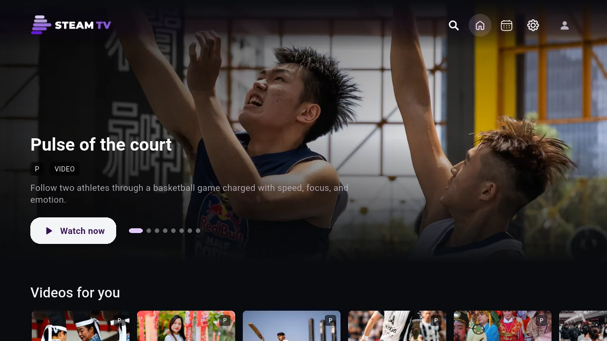</td>
<td align="center"><em>waiting for<br><code>docs/images/home-overview-tizen.webp</code></em></td>
</tr>
</table>

*The hero fills the viewport width and sits **behind** the top bar; the first rail begins immediately
below it, signalling that the viewer can continue downward. The hero's own gradients carry the
legibility, which is why the top bar asks for no extra readability layer while the hero holds focus.*

### Content rails

Home receives a vertical list of sections; each section owns a `title`, a `viewType` and a horizontal
list of content. Four view types, all built on the same `TvListView` foundation.

<table>
<tr><th width="50%">Android TV</th><th width="50%">Tizen TV</th></tr>
<tr>
<td>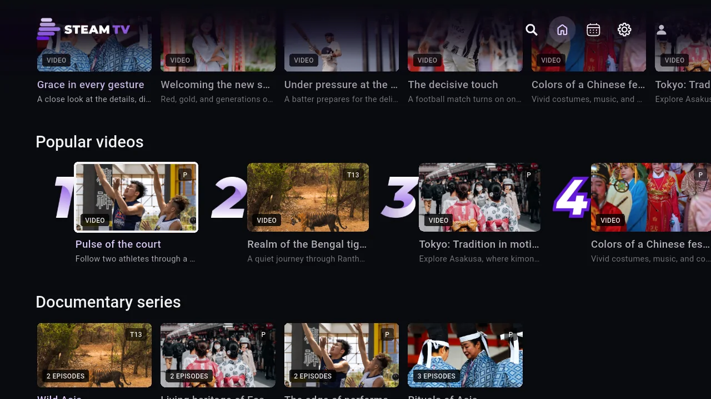</td>
<td align="center"><em>waiting for<br><code>docs/images/home-rows-tizen.webp</code></em></td>
</tr>
<tr><td colspan="2"><em><strong>Popular videos</strong> — a ranked rail whose numerals bleed past the leading edge of the card.</em></td></tr>
<tr>
<td>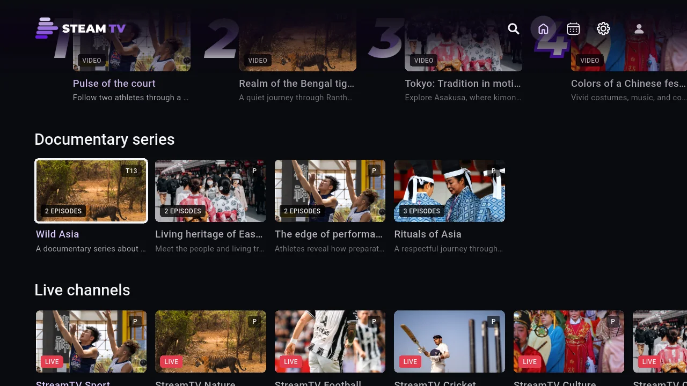</td>
<td align="center"><em>waiting for<br><code>docs/images/home-series-tizen.webp</code></em></td>
</tr>
<tr><td colspan="2"><em><strong>Documentary series</strong> — cards carrying an episode-count badge; finite, because there are only four items.</em></td></tr>
<tr>
<td>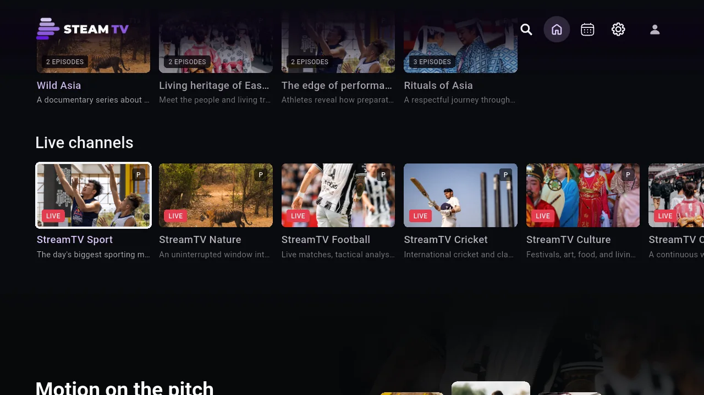</td>
<td align="center"><em>waiting for<br><code>docs/images/home-channels-tizen.webp</code></em></td>
</tr>
<tr><td colspan="2"><em><strong>Live channels</strong> — a red LIVE badge; these streams report no duration, so the player drops its seek bar and shows an elapsed-time label instead.</em></td></tr>
<tr>
<td>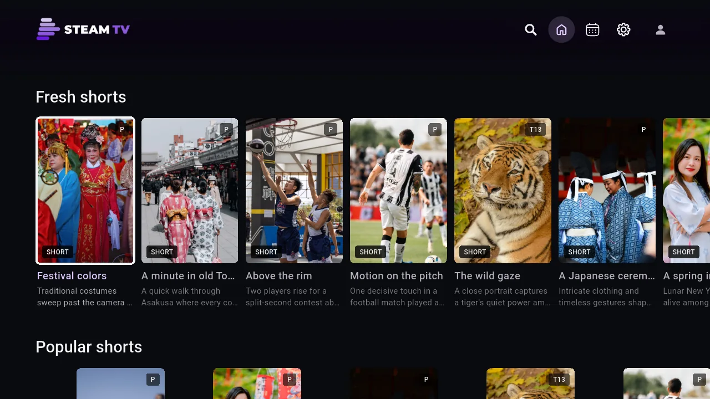</td>
<td align="center"><em>waiting for<br><code>docs/images/home-shorts-tizen.webp</code></em></td>
</tr>
<tr><td colspan="2"><em><strong>Fresh shorts</strong> — portrait thumbnails. Selecting one opens the <strong>portrait</strong> player, decided from the item's own kind rather than from the row it was pressed in.</em></td></tr>
</table>

Thumbnails are **never darkened** by selection. Selection brightens the title and adds a border —
darkening the image makes a rail look disabled when the viewer moves quickly.

### The portrait carousel

<table>
<tr><th width="50%">Android TV</th><th width="50%">Tizen TV</th></tr>
<tr>
<td>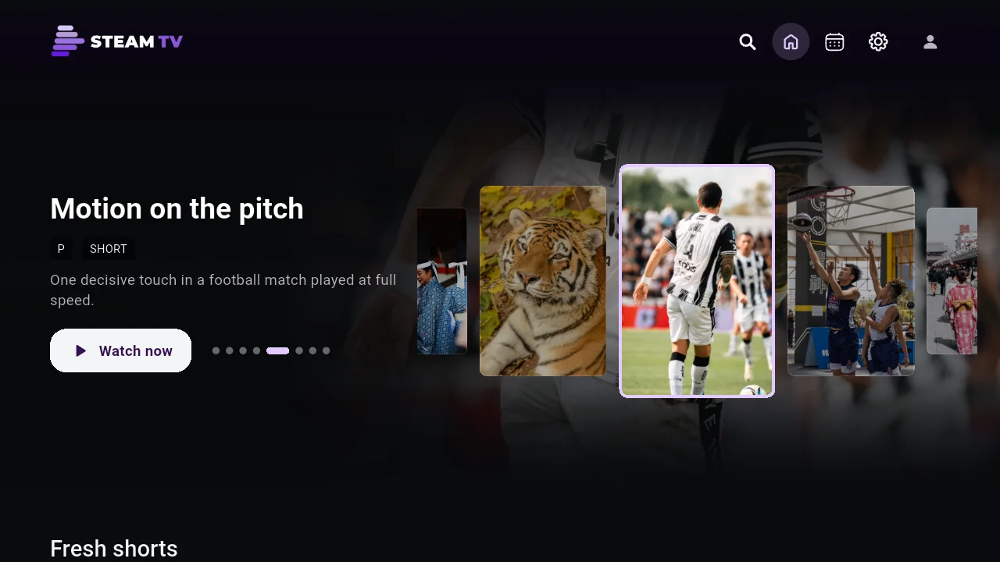</td>
<td align="center"><em>waiting for<br><code>docs/images/home-vertical-banner-tizen.webp</code></em></td>
</tr>
</table>

*The centre item is scaled up and the section carries its own ambient background, so every item change
is also a change of tone. The same short appears here, in the shorts rail and in the popular rail —
and opens the same portrait player from all three.*

---

## 2. Focus is the cursor on television

There is no mouse pointer on a television. Focus **is** the cursor, so it must always be visible and
must have exactly one owner after every transition.

### Top-bar items expand on focus

<table>
<tr><th width="50%">Android TV</th><th width="50%">Tizen TV</th></tr>
<tr>
<td>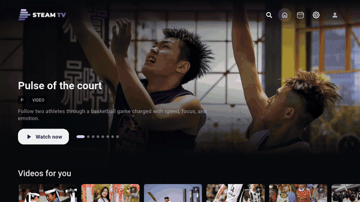</td>
<td align="center"><em>waiting for<br><code>docs/images/topbar-focus-tizen.gif</code></em></td>
</tr>
</table>

*A top-bar item normally shows only its icon; on focus it expands horizontally and reveals its English
label. While the top bar holds focus, a translucent surface layer covers the destination beneath it,
so it is obvious who currently owns navigation.*

Three rules matter most:

- **Destinations do not steal focus.** Selecting a different destination leaves focus on the top bar.
  A destination claims focus only when the top bar is not holding it — on cold launch, and on return
  from a player.
- **Re-entering the top bar restores the selected destination**, rather than jumping to the first item.
- **The top bar has a second, separate layer**: a readability gradient from the surface colour down to
  transparent, requested by the destination rather than by the bar. Home asks for it only once focus
  leaves the hero, because the hero already carries its own scrim.

### `TvListView`: one focus target, with the list sliding beneath it

<table>
<tr><th width="50%">Android TV</th><th width="50%">Tizen TV</th></tr>
<tr>
<td>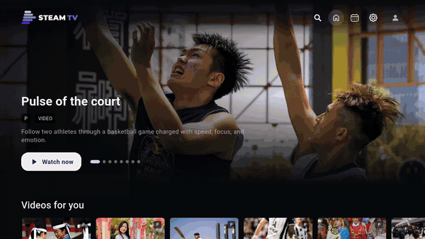</td>
<td align="center"><em>waiting for<br><code>docs/images/home-row-navigation-tizen.gif</code></em></td>
</tr>
</table>

*Down into a rail, then right along it. The selector stays put at the leading content edge; it is the
list that slides underneath.*

---

## 3. Search, Calendar, Setting and Profile

The shell's four remaining destinations, each solving a different television problem.

<table>
<tr><th width="50%">Android TV</th><th width="50%">Tizen TV</th></tr>
<tr>
<td>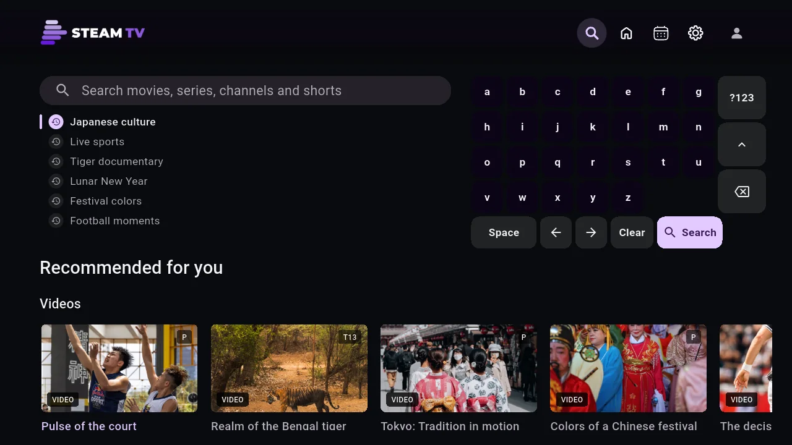</td>
<td align="center"><em>waiting for<br><code>docs/images/search-tizen.webp</code></em></td>
</tr>
<tr><td colspan="2"><em><strong>Search</strong> — the input field, the history and the a–z keyboard grid all sit in the first viewport. The viewer never has to leave the results in order to type.</em></td></tr>
<tr>
<td>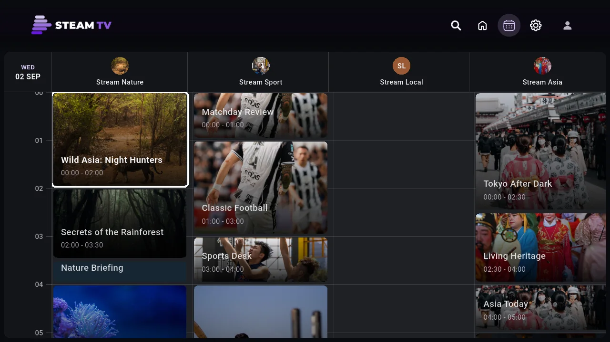</td>
<td align="center"><em>waiting for<br><code>docs/images/calendar-tizen.webp</code></em></td>
</tr>
<tr><td colspan="2"><em><strong>Calendar</strong> — time runs down, channels run across. A programme cell is as tall as its actual duration, so a two-hour programme really is twice the height of a one-hour one.</em></td></tr>
<tr>
<td>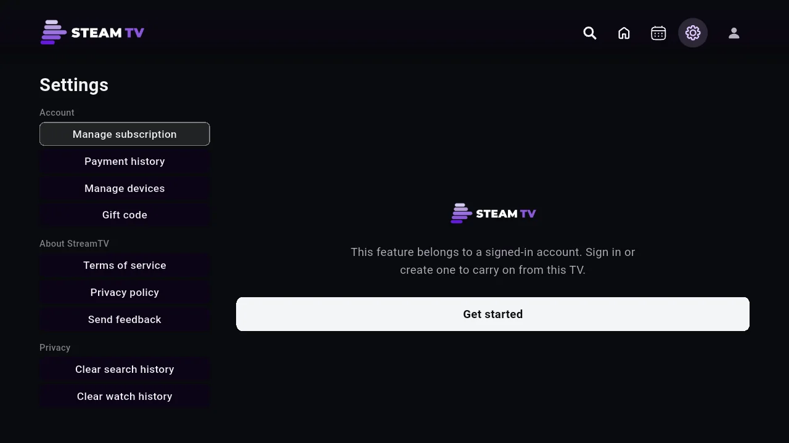</td>
<td align="center"><em>waiting for<br><code>docs/images/setting-tizen.webp</code></em></td>
</tr>
<tr><td colspan="2"><em><strong>Setting</strong> — two panes, the left list driving the right, grouped into Account / About / Privacy. <code>Manage subscription</code> is drawn <strong>selected but not focused</strong>: focus is in the pane, and without that distinct state the viewer loses track of which entry the pane belongs to. Entries never grow on focus — at this density a scaled entry would overlap its neighbours.</em></td></tr>
<tr>
<td>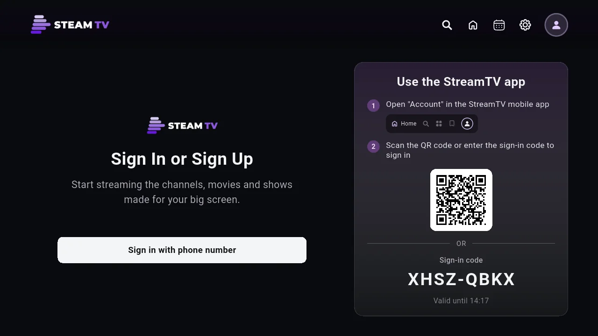</td>
<td align="center"><em>waiting for<br><code>docs/images/profile-tizen.webp</code></em></td>
</tr>
<tr><td colspan="2"><em><strong>Profile</strong> — typing a password on a D-pad is a poor experience, so this screen leads with a QR code and a time-limited sign-in code.</em></td></tr>
</table>

---

## 4. The landscape player

`PlayerScreen` handles content shot landscape: videos, series episodes and live channels. The video
fills the panel and **every piece of chrome is transient**.

<table>
<tr><th width="50%">Android TV</th><th width="50%">Tizen TV</th></tr>
<tr>
<td>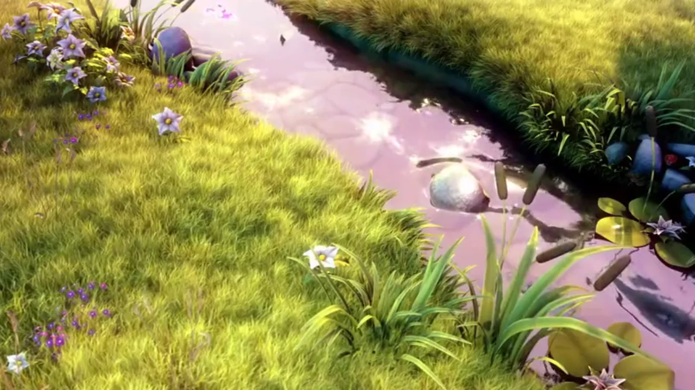</td>
<td align="center"><em>waiting for<br><code>docs/images/player-surface-tizen.webp</code></em></td>
</tr>
</table>

*The default state: nothing but the picture. An invisible full-screen input target holds the D-pad and
waits for the first key.*

### The controller

<table>
<tr><th width="50%">Android TV</th><th width="50%">Tizen TV</th></tr>
<tr>
<td>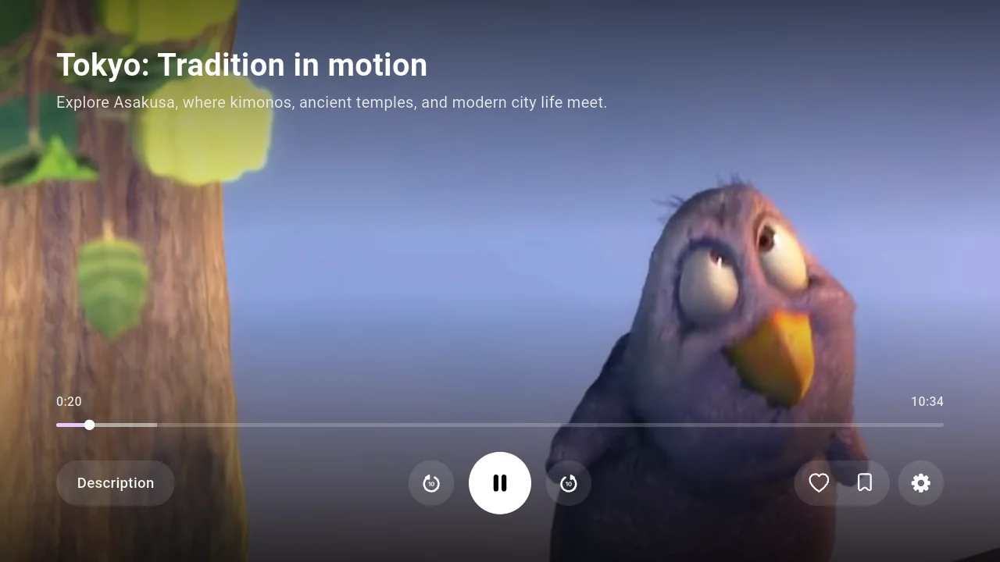</td>
<td align="center"><em>waiting for<br><code>docs/images/player-controller-tizen.webp</code></em></td>
</tr>
</table>

*Press any direction to reveal the controller. A vertical scrim darkens the top and bottom edges and
stays fully transparent across the middle, so text remains legible over any frame without dimming the
part the viewer is actually watching.*

The control row is divided into three clusters:

| Cluster | Alignment | Contents |
|---|---|---|
| Leading | Leading edge | The `Description` pill |
| Transport | **Centred on the panel** | Rewind, play/pause, forward |
| Trailing | Trailing edge | Like, save, and settings when the platform offers it |

The transport cluster is centred on the **panel**, not on the space between the other two — which is
why its position does not shift when a stream has no settings and that control disappears. That is
not a hypothetical: it is exactly what happens on Tizen.

A focused control **does not scale**; it **inverts** — an opaque white fill, a dark glyph, and a
caption naming it directly beneath.

### Down from the seek bar returns to the control you last used

<table>
<tr><th width="50%">Android TV</th><th width="50%">Tizen TV</th></tr>
<tr>
<td>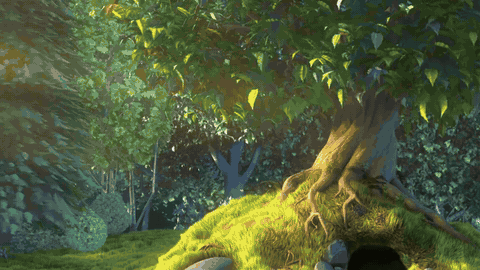</td>
<td align="center"><em>waiting for<br><code>docs/images/player-focus-restore-tizen.gif</code></em></td>
</tr>
</table>

*The chrome auto-hides after five seconds, and comes back on **the control the viewer last used** —
here Settings, not play/pause. Up moves to the seek bar; Down returns to Settings.*

The remembered control is state, not a saved `FocusNode`: the controller subtree is unmounted while
hidden, so a node reference would not survive. Down from the control row **does nothing at all** —
letting it fall through hands focus to the video surface, which immediately hides the controller the
viewer is still using.

### The section stack

Sections open on the trailing edge inside a rounded, dark, translucent panel. Every level stays
composed beneath its child, so a parent keeps its list state.

<table>
<tr><th width="50%">Android TV</th><th width="50%">Tizen TV</th></tr>
<tr>
<td>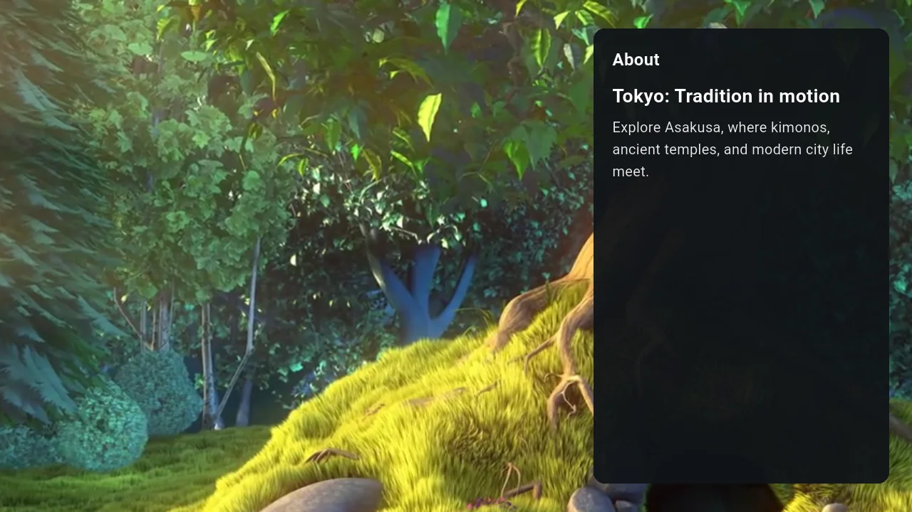</td>
<td align="center"><em>waiting for<br><code>docs/images/player-metadata-section-tizen.webp</code></em></td>
</tr>
<tr><td colspan="2"><em><strong>Metadata</strong> — opened from the <code>Description</code> pill. Back returns focus to that pill, not to the entry control.</em></td></tr>
<tr>
<td>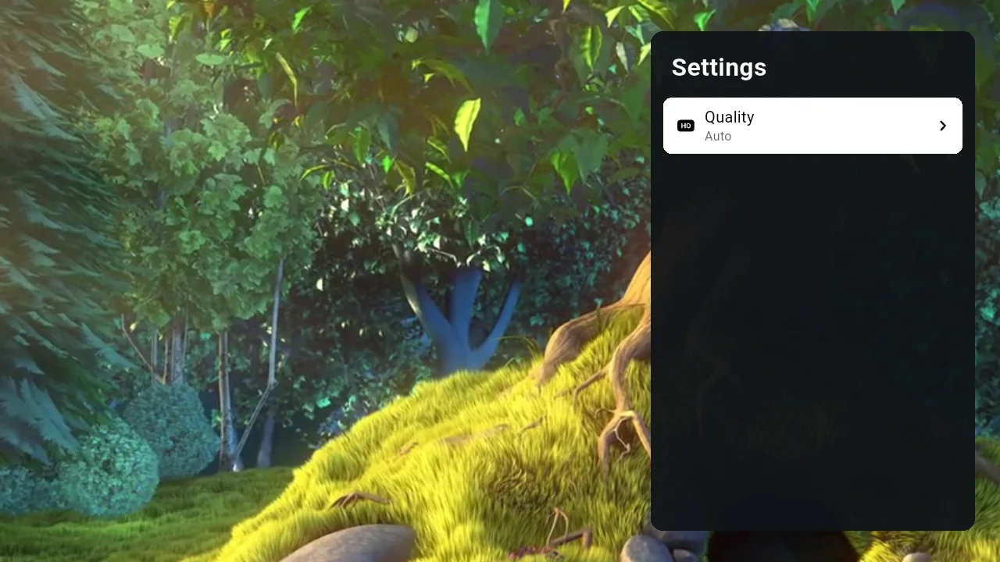</td>
<td align="center"><strong>Not applicable on Tizen</strong> — see below</td>
</tr>
<tr><td colspan="2"><em><strong>Settings</strong> — one row per category: an icon, the category name, and <strong>the value in effect stacked underneath it</strong> rather than trailing it, because a long rendition label ellipsises away at this panel width and the value is the half the viewer opened the panel to check. The chevron is what tells a category row apart from an option row at a glance — one opens a list, the other commits a choice, and a remote has no hover state to disambiguate them. Settings never shows an empty category, and a category with a single option is dropped: on a remote it costs three presses to learn it could not have been anything else. This stream carries no subtitles and no alternative audio, so the root panel holds a single Quality row.</em></td></tr>
<tr>
<td>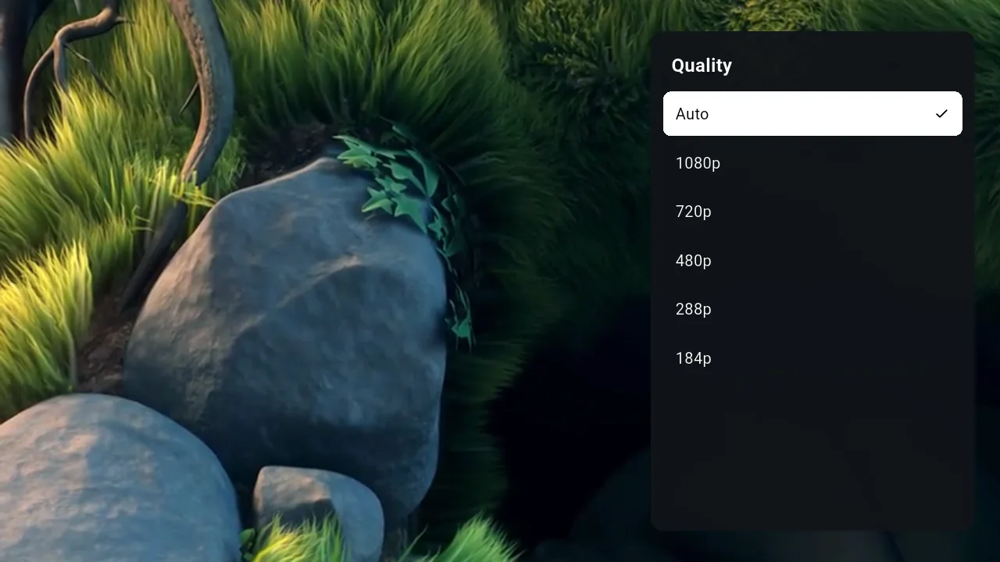</td>
<td align="center"><strong>Not applicable on Tizen</strong> — see below</td>
</tr>
<tr><td colspan="2"><em><strong>Settings → Quality</strong> — the rendition list read straight from the manifest, with <code>Auto</code> ticked because nothing has been pinned. A focused row inverts to a white fill; the row holding the value in effect keeps a faint fill and a hairline once focus moves off it, because at three metres the tick alone is easy to miss and it is the only other signal. The settings list stays composed underneath rather than being replaced, so returning to it keeps its scroll position and selected row.</em></td></tr>
</table>

**Why two cells say "not applicable" rather than waiting for a screenshot.** The Tizen host reports
`StreamPlayerCapabilities.basic`, which does not include track selection. With no selectable
renditions there are no categories, `settings.isAvailable` is false, and the settings control is
**never rendered** on Tizen. There is no Tizen screenshot to take: pretending otherwise would leave a
gap nobody ever closes. See [section 6](#6-one-dart-api-two-native-players).

---

## 5. The portrait player

A television panel is landscape; a short is not. Rather than letterboxing it into two narrow bars or
cropping away the top and bottom of the frame, `VerticalPlayerScreen` builds a 9:16 stage centred and
nudged toward the leading edge, and **gives the freed width back to the content itself**.

<table>
<tr><th width="50%">Android TV</th><th width="50%">Tizen TV</th></tr>
<tr>
<td>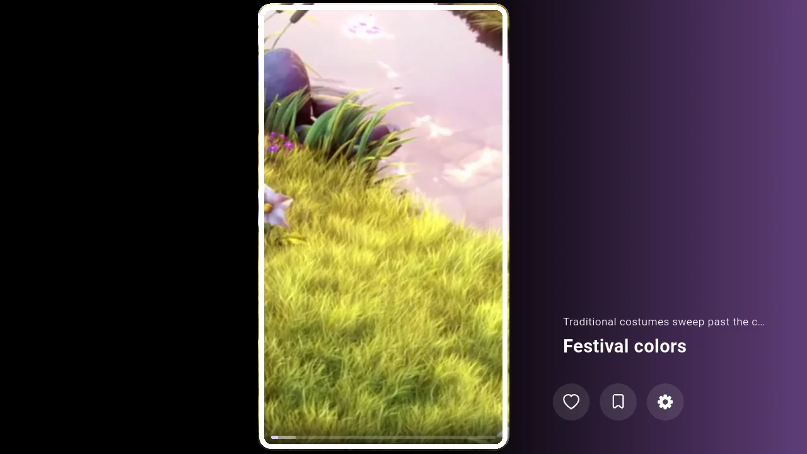</td>
<td align="center"><em>waiting for<br><code>docs/images/vertical-player-tizen.webp</code></em></td>
</tr>
</table>

*Three regions: a horizontal ambient gradient, a rounded 9:16 stage (the video crops to fill it, so no
bars appear inside the stage), and the interaction panel on the trailing edge.*

The stage is **centred on the panel and then nudged toward the leading edge**, not aligned to it.
Pinning it left is the obvious reading of "leave room for the panel" and it is wrong: it strands the
portrait frame against the bezel with the whole gradient trailing off to one side. Centring keeps the
video where a viewer several metres back is already looking, and the offset still opens a column for
the panel.

It is also a real focus target, not a passive surface — Select on it toggles playback — so it carries
an inset focus border. The border **announces focus at full white and then softens** over the
following second to a faint outline. The stage holds focus for most of a viewing session, and a
permanent 6-unit white frame around every short is louder than the content it is framing; a Select
press restarts the cycle, because a press is when the viewer wants confirming they were aiming at the
right thing.

This screen has **no** transport cluster, no seek bar, no `Description` pill and no caption under its
controls. The stage itself is the play/pause control, and the title block is the way into metadata.

<table>
<tr><th width="50%">Android TV</th><th width="50%">Tizen TV</th></tr>
<tr>
<td>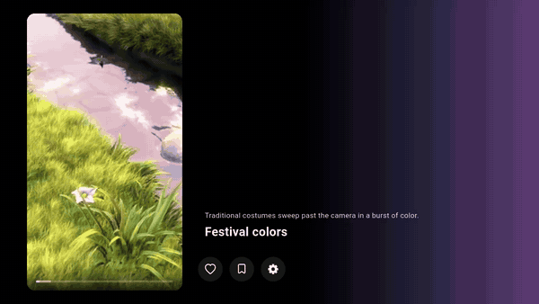</td>
<td align="center"><em>waiting for<br><code>docs/images/vertical-player-panel-tizen.gif</code></em></td>
</tr>
<tr><td colspan="2"><em>Right from the stage lands on the <strong>first action</strong> — not the title block, which is one step Up from there. Left from the first action returns to the stage, while Left from a later action only moves within the row.</em></td></tr>
<tr>
<td>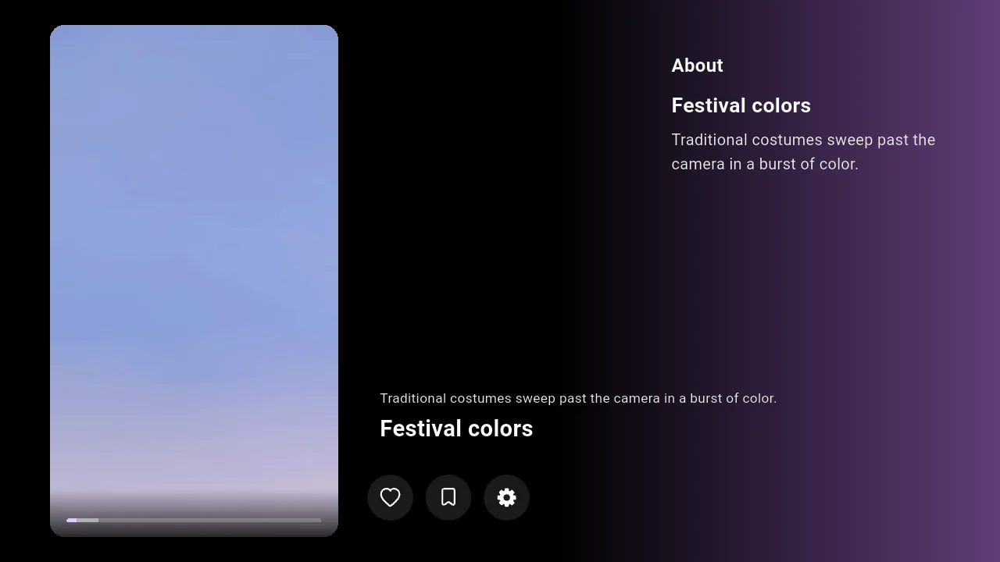</td>
<td align="center"><em>waiting for<br><code>docs/images/vertical-player-metadata-tizen.webp</code></em></td>
</tr>
<tr><td colspan="2"><em>The same section tree as the landscape player, but drawn <strong>transparent</strong> over the ambient background rather than inside a rounded panel. That framing difference lives at the screen boundary; the section content itself is shared.</em></td></tr>
</table>

### Two players, one section stack

| | Landscape player | Portrait player |
|---|---|---|
| Video fit | Letterboxed, fills the panel | Cropped into a centred 9:16 stage |
| Background | The video itself | Horizontal ambient gradient |
| Chrome lifetime | Transient, auto-hides after 5s | Permanent |
| Transport | Rewind, play/pause, forward | None; the stage is the control |
| Seek bar | Focusable, with thumb and time labels | Non-interactive progress line |
| Metadata entry | The `Description` pill | The title block |
| Caption under controls | Yes | No |
| Section panel | Rounded, dark, translucent | Transparent over the ambient background |
| Section dismissal | Back | Back or Left |
| Focus after closing a section | The control that opened it | The stage |

Both screens share one immutable `PlayerSectionStack` and one `resolvePlayerFocusOwner`:

- **Exactly one group owns the D-pad at any moment**, and that group is *a single derived value*, not
  a set of independent flags. Precedence, highest first: `error`, `parked`, `section`, `controller`,
  `surface`.
- **Focus is handed out in exactly one place.** A subtree must not request focus for itself while the
  owner is also deciding.

The full rules, including the transition phases and the parked anchor:
[`doc_architechture/player_sections.md`](doc_architechture/player_sections.md). The product contract
they implement: [`spec/player.md`](../steam_tv/spec/player.md) and
[`spec/vertical-player.md`](../steam_tv/spec/vertical-player.md).

---

## 6. One Dart API, two native players

The Flutter layer owns UI and calls methods. It never touches a platform player. Between them sits a
method channel and a federated plugin, in the sibling project
[`flutter_stream_player`](../flutter_stream_player):

```text
                    flutter-steam-tv  (UI, Riverpod, focus)
                             │
                     stream_player     ← the only import the app makes
                             │
        stream_player_platform_interface   ← one closed command set, one event vocabulary
                    ┌────────┴────────┐
     stream_player_android      stream_player_tizen
       Media3 / ExoPlayer         video_player_tizen
        (MethodChannel +            (pure Dart adapter)
         EventChannel)
```

The app registers its host explicitly at startup rather than relying on automatic plugin registration
— see [`lib/core/player/stream_player_host.dart`](lib/core/player/stream_player_host.dart) for why
"whichever host has not claimed the seam" would silently install the Tizen host on Android and quietly
lose quality selection.

### What actually differs between the two platforms

Every host declares what it supports, and the UI is gated on that declaration rather than on a
platform check:

| Capability | Android TV (Media3) | Tizen (`video_player_tizen`) |
|---|---|---|
| Play, pause, seek | ✅ | ✅ |
| Playback speed | ✅ | ✅ |
| Video track selection (Quality) | ✅ | ❌ |
| Audio track selection | ✅ | ❌ |
| Text track selection | ✅ | ❌ |
| Bitrate constraints | ✅ | ❌ |
| Client-side ads | ✅ | ❌ |
| Subtitle cues | ✅ | ❌ |

A command for a capability the host lacks is a no-op, not a crash — but the UI never sends one,
because a control it cannot honour is never drawn. That is why the settings button is simply absent on
Tizen instead of opening an empty panel.

`StreamPlayerTizen` is deliberately a thin adapter over `video_player_tizen`, and it is the documented
swap seam: replacing it with a purpose-built Tizen plugin changes that one package and nothing in this
app. The full design, including the wire protocol and the reducer:
[`doc_architechture/native_player_bridge.md`](doc_architechture/native_player_bridge.md).

---

## 7. Reproducing these captures

Every **Android TV** image and GIF above is reproducible. None of them is a hand-taken screenshot left
to drift out of date.

```bash
python3 tools/capture_media.py list
python3 tools/capture_media.py shot player-controller
python3 tools/capture_media.py gif player-focus-restore
python3 tools/capture_media.py all
```

Requires `adb` on PATH with **exactly one** attached device, and `ffmpeg` for GIF conversion.

Each capture separates `setup` (the key path needed to get there, not recorded) from `steps` (the
demonstration itself), and every run force-stops the app and waits for it to take window focus again,
so no capture inherits another's focus. Stills are written as WebP, GIFs through a two-pass ffmpeg
palette. Output lands in [`docs/images/`](docs/images/), always suffixed `-android`.

[`updateReadme.md`](updateReadme.md) is the companion runbook: which captures to re-run for a given
source change, when a GIF is warranted over a still, which dummy item each demo depends on, and how to
add the Tizen column.

---

# Technical reference

## Project structure

Feature-first, with the dependency direction `View → ViewModel → Repository → DataSource`. Domain code
imports neither Flutter nor Dio nor any data-layer implementation.

```text
lib/
├── app/
│   ├── router/                 # go_router graph
│   └── stream_tv_app.dart
├── core/
│   ├── design_system/          # StreamTvColors, theme, typography
│   ├── network/
│   ├── player/                 # registerStreamPlayerHost()
│   └── widgets/                # SteamTopBar, TvListView, ListContentView
└── features/
    ├── calendar/  home/  main/  player/  profile/  search/  setting/
        ├── data/               # DTOs, sources, mappers, repository impls
        ├── domain/             # immutable models, repository interfaces
        └── presentation/       # view/, view_model/, widget/, model/
```

`core/` holds only what has a genuine cross-feature consumer. A feature's Riverpod wiring stays at the
feature root so data implementations remain framework-agnostic.

## Riverpod

- **Generated providers only.** `@riverpod` / `@Riverpod(keepAlive: true)` with `riverpod_generator`;
  generated files are never edited by hand.
- **ViewModels are `Notifier` / `AsyncNotifier` classes** with public action methods and no mutable
  public fields.
- **`AsyncValue<T>` is the LCE state.** It is not duplicated with an `isLoading` boolean beside a
  nullable value and a nullable error.
- **Riverpod 3 removed `valueOrNull`.** Read a possibly-absent value with `.value` (nullable) or
  `.requireValue`. The old name fails as `undefined_getter`, not as a deprecation.
- `ref.watch` for reactive dependencies, `ref.read` in event callbacks, `ref.listen` for one-shot side
  effects.
- Providers are auto-dispose by default; `keepAlive` is for app-lifetime infrastructure only.
- Tests and previews override providers rather than switching on an `isTest` flag.

Regenerate after touching an annotated class:

```bash
dart run build_runner build --delete-conflicting-outputs
```

## Navigation

Two levels in one `GoRouter`. The browsing shell is a `ShellRoute` that owns the top bar; the two
players are **siblings** of the shell, so they take the whole screen without anyone having to hide the
bar.

```text
GoRouter
├── ShellRoute ─────────► MainScreen (SteamTopBar + destination)
│   ├── /                 HomeScreen
│   ├── /search           SearchRoute
│   ├── /calendar         CalendarRoute
│   ├── /setting          SettingRoute
│   └── /profile          ProfileRoute
├── /player/:itemId          PlayerRoute
└── /player/vertical/:itemId VerticalPlayerRoute
```

- A destination has a top bar if and only if it is registered inside the `ShellRoute`. There is no
  route-prefix predicate deciding whether to hide it.
- Only the item **id** travels to a player. The player resolves the item from the same catalogue Home
  read, which is what keeps the two from drifting — and is what makes a deep link into the player
  work.
- Home `push`es the player rather than `go`ing to it, so Back returns to the rail with focus where the
  viewer left it.

## Presentation conventions

- A Riverpod-aware `Route` is separated from a pure `Screen` and small presentation widgets. Home is
  the documented exception: `HomeScreen` is its own feature boundary.
- Every new or materially changed screen has deterministic preview coverage, including Loading,
  Content and Error where the screen uses LCE. Preview code uses no network, no real player, no
  `dart:io` and no native-only plugin.
- D-pad focus is explicit. Remote Select invokes the same action as tap.
- Focus borders stay inside stable widget dimensions, so gaining focus never shifts the layout around
  it.

## Build and run

Android TV:

```bash
flutter build apk --debug
adb install -r build/app/outputs/flutter-apk/app-debug.apk
```

Tizen (requires the [Tizen Studio toolchain](https://developer.tizen.org/development/tizen-studio)
and `flutter-tizen` on PATH):

```bash
flutter-tizen build tpk --device-profile tv
flutter-tizen install
```

Tests and static analysis:

```bash
flutter analyze
flutter test
```

## Specifications and design notes

`spec/` in the [`steam_tv`](../steam_tv/spec) project is the framework-neutral product contract shared
by both implementations — read it before implementing, or before porting to another platform.

| Document | What it covers |
|---|---|
| [`doc_architechture/native_player_bridge.md`](doc_architechture/native_player_bridge.md) | The Flutter ↔ native playback seam, the wire protocol, and the Tizen swap point |
| [`doc_architechture/player_sections.md`](doc_architechture/player_sections.md) | The section stack, focus ownership, and the parked anchor |
| [`doc_architechture/flutter_tv_focus.md`](doc_architechture/flutter_tv_focus.md) | D-pad focus on Flutter for TV |
| [`doc_architechture/riverpod_clean_architecture.md`](doc_architechture/riverpod_clean_architecture.md) | How the layers map onto Riverpod |
| [`AGENT.md`](AGENT.md) | The engineering rules this project is held to |
| [`updateReadme.md`](updateReadme.md) | How to re-capture the images in this file |
