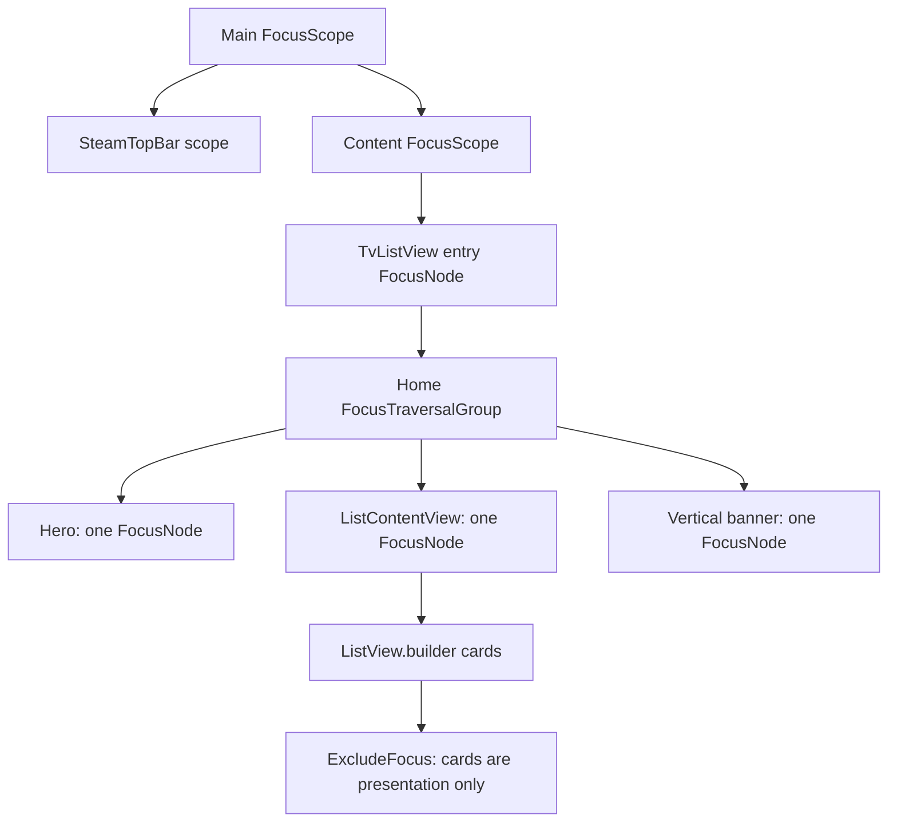
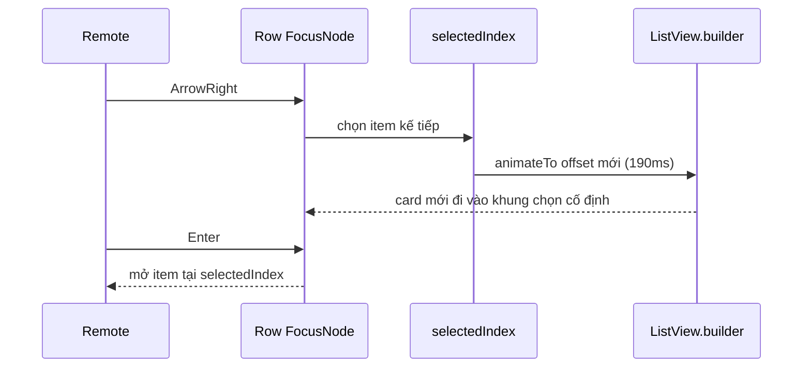

# Flutter TV focus architecture

Tài liệu này quy định cách quản lý focus bằng D-pad cho Flutter StreamTV. Mục tiêu là chuyển
focus ổn định giữa top bar, các section của Home và action trong dialog mà không phụ thuộc vào
widget nào đang được lazy list dựng ở thời điểm hiện tại.

## Khái niệm chính

- `FocusNode` đại diện cho một focus target. Node là đối tượng sống lâu, vì vậy phải tạo trong
  `State`, gắn `debugLabel` và `dispose`; không tạo node mới trong mỗi lần `build`.
- `FocusScopeNode` là ranh giới focus. Scope có thể ghi nhớ child đã focus gần nhất, nhưng entry từ
  top bar vào feed Home phải đi qua entry node của `TvListView` để luôn bắt đầu tại index `0`.
- `Focus` nhận key event tại primary focus. Event truyền từ node đang focus lên ancestor cho tới khi
  một handler trả `KeyEventResult.handled`.
- `FocusTraversalGroup` gom các section vào cùng một chính sách traversal dọc. Home vẫn xử lý
  trái/phải tại từng section để kết quả không phụ thuộc hình học của card.
- `requestFocus()` có thể cập nhật primary focus trễ một frame. Logic cần cuộn tới section lazy
  trước, chờ frame layout, rồi mới request focus.

Tài liệu chính thức:

- [Understanding Flutter focus](https://docs.flutter.dev/ui/interactivity/focus)
- [FocusNode API](https://api.flutter.dev/flutter/widgets/FocusNode-class.html)
- [FocusNode.requestFocus](https://api.flutter.dev/flutter/widgets/FocusNode/requestFocus.html)
- [Focus traversal and ensureVisible](https://api.flutter.dev/flutter/widgets/FocusTraversalPolicy/defaultTraversalRequestFocusCallback.html)

## Cây focus của ứng dụng TV



Top bar và content là hai scope tách biệt. Khi nhấn `Down`, shell chuyển focus tới entry target đầu
tiên đang mounted trong content scope. `TvListView` nhận entry focus, đưa scroll về đầu và focus
descendant đầu tiên của item index `0`; core list không biết item đó là hero, row hay banner. Không
dùng `focusedChild` của content scope vì nó có thể còn trỏ tới element đã defunct của route cũ. Khi
nhấn `Up` mà không còn section phía trên, shell đưa focus về top bar.

## Fixed-selection row

`ListContentView.builder/separated` có đúng một focus target nằm tại mép trái `48dp`.
`ListView.builder` bên dưới chỉ dựng card đang hiển thị và vùng cache; các card được bọc
`ExcludeFocus`.



Quy ước xử lý key:

| Key | Kết quả |
| --- | --- |
| `Left` tại item đầu | Trả `ignored` để ancestor/traversal có thể xử lý |
| `Left`/`Right` hợp lệ | Đổi selection, cuộn 190ms và trả `handled` |
| `Right` tại cuối hàng hữu hạn | Giữ selection và trả `handled` |
| `Enter`, `Select`, `NumpadEnter` | Mở item đang chọn và trả `handled` |
| Key khác | Trả `ignored` |

Hàng không xếp hạng có hơn năm item được phép lặp từ cuối về đầu. Hàng có tối đa năm item hoặc có
thứ hạng là hữu hạn. Trong lúc animation đang chạy, không bắt đầu thêm một animation selection.

[`ListView.builder`](https://api.flutter.dev/flutter/widgets/ListView/ListView.builder.html) được dùng
để dựng item theo nhu cầu. Luôn truyền `itemCount`, key ổn định và `cacheExtent` đủ cho ít nhất một
card kế bên.

## Focus theo section của Home

Home lưu hai lớp trạng thái trình bày trong `State` của view:

1. `focusedSectionIndex`: section gần nhất sở hữu focus.
2. `selectedIndexBySectionId`: item đang chọn của từng row/banner.

Đây là UI state ngắn hạn, không phải dữ liệu nghiệp vụ nên không đưa vào Repository. Riverpod
`HomeViewModel` chỉ quản lý LCE và dữ liệu Home. Khi danh sách mới ngắn hơn, index được clamp về phạm
vi hợp lệ.

```text
Provider AsyncValue<List<HomeSection>>
                 |
                 v
            HomeScreen
        loading / content / error
                 |
                 v
      HomeContentView (focus memory)
                 |
      +----------+----------+
      v          v          v
    Hero   ListContentView VerticalBanner
   1 node       1 node        1 node
```

Feed dọc dùng `TvListView.builder/separated`. Widget bọc mỗi item bằng một `Focus` không thể tự nhận
focus để quan sát descendant. Khi một section nhận focus, list gọi `ensureVisible` với đúng một
anchor: `0.0` cho item đầu, `0.5` cho item giữa và `1.0` cho item cuối. Nhờ đó các hàng giữa không
nhảy tới nhiều vị trí khác nhau khi người dùng nhấn Up/Down.

`TvListView` còn là focus entry của feed. Nếu entry node nhận primary focus, list jump về scroll
offset đầu, chờ item lazy index `0` được dựng rồi request focus vào descendant focusable đầu tiên của
chính item đó. Up/Down đi qua ancestor handler với khoảng khóa mặc định `280ms`; event lặp trong thời
gian khóa trả `handled`, còn event hợp lệ trả `ignored` để Flutter traversal chuyển đúng một section.

## Checklist khi thêm view TV

- Mỗi vùng điều hướng có số focus target nhỏ nhất có thể dự đoán được.
- Node có owner rõ ràng, `debugLabel`, lifecycle và test D-pad.
- Khung focus nằm bên trong kích thước cố định để không làm layout nhảy.
- Select và click gọi cùng callback.
- Item của lazy list không được giữ node đã dispose.
- Có test cho biên trái/phải, loop, Enter và trả focus từ top bar.
- Preview không tải mạng; thumbnail rỗng phải hiển thị placeholder ổn định.
