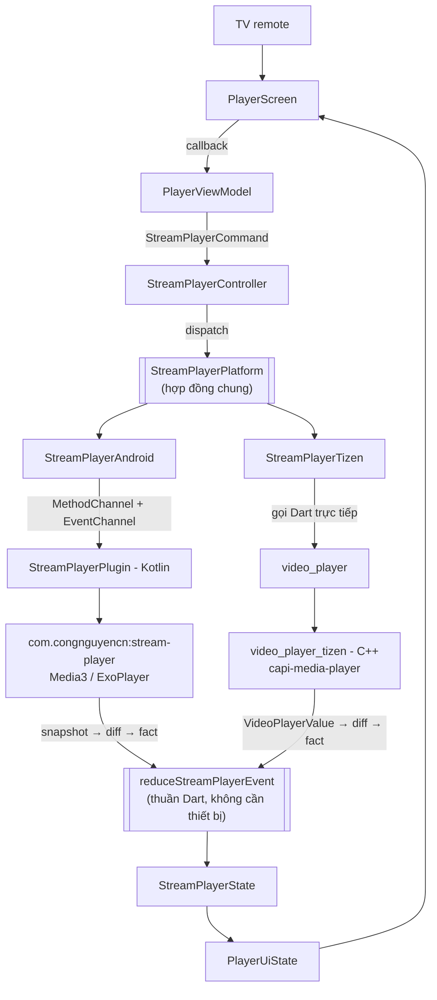
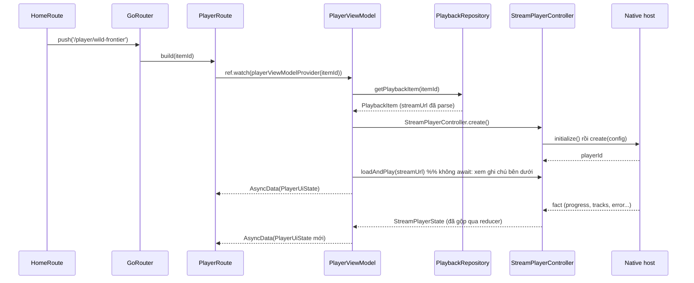

# Cầu nối player native (`flutter_stream_player`)

Tài liệu này giải thích cách `flutter_steam_tv` phát video: một API Flutter duy nhất, phía dưới là
player native khác nhau cho từng hệ điều hành. Tầng Flutter chỉ vẽ UI và gọi lệnh; mọi quyết định về
buffering, chọn rendition, phân loại lỗi và quảng cáo đều nằm ở tầng native.

> Bản đồ đầy đủ của package nằm ở [`../../flutter_stream_player/architecture.md`](../../flutter_stream_player/architecture.md).
> Hợp đồng trên đường truyền nằm ở [`../../flutter_stream_player/doc/channel_contract.md`](../../flutter_stream_player/doc/channel_contract.md).
> Tài liệu này chỉ nói phần **app dùng nó như thế nào**.

## 1. Hình dung tổng thể



Bốn quy tắc quyết định toàn bộ thiết kế:

1. **Ghi là giá trị.** Mọi thay đổi là một object `StreamPlayerCommand`, nên nó log được, test được
   mà không cần player, không cần channel, không cần thiết bị.
2. **Đọc là một snapshot.** `StreamPlayerState` chứa tất cả những gì player biết, bất biến, trong một
   giá trị. Không màn hình nào tự suy luận lại "đang phát thật hay chỉ đang cố phát".
3. **Native phát ra *fact*, Dart gộp lại.** Native **không** serialize toàn bộ state mỗi lần đổi. Nó
   gửi fact hẹp nhất (`progressChanged` = ba số nguyên), rồi một reducer thuần trong Dart gộp thành
   snapshot. Nhờ vậy: payload nhỏ (tick 500 ms suốt cả bộ phim), và quan hệ giữa các field được định
   nghĩa **đúng một lần** cho mọi nền tảng.
4. **Không đổi thì trả về đúng instance cũ.** `StreamPlayerController` so sánh bằng `identical`, nên
   `Stream` state hoàn toàn im lặng khi player đứng yên.

## 2. Dependency và đăng ký host

`pubspec.yaml`:

```yaml
dependencies:
  stream_player:
    path: ../flutter_stream_player/packages/stream_player
  stream_player_tizen:
    path: ../flutter_stream_player/packages/stream_player_tizen
```

`stream_player_tizen` được khai báo cho mọi nền tảng vì pubspec không tách theo platform. Trên bản
build Android, phần native của nó bị flutter tool bỏ qua (nó chỉ khai báo platform `tizen`), chỉ code
Dart được biên dịch.

Đăng ký host trong [`lib/core/player/stream_player_host.dart`](../lib/core/player/stream_player_host.dart),
gọi từ `main()`:

```dart
void registerStreamPlayerHost() {
  if (StreamPlayerPlatform.isRegistered) {
    return;
  }
  if (Platform.isAndroid) {
    StreamPlayerAndroid.registerWith();
    return;
  }
  StreamPlayerTizen.registerWith();
}
```

Ba điểm đều có chủ ý:

- **`isRegistered` guard.** `stream_player_android` khai báo `dartPluginClass`, nên Dart plugin
  registrant sinh tự động có thể đã đăng ký host Android trước khi `main` chạy. Guard biến trường hợp
  đó thành no-op, và làm hot restart vô hại.
- **Gọi tên platform rõ ràng.** Viết kiểu "cái nào chưa ai chiếm thì đăng ký" trông gọn hơn nhưng
  sai: nếu registrant của Android vì lý do nào đó không chạy, bản đó sẽ **âm thầm** cài host *Tizen*
  trên Android — nơi `video_player` vẫn chạy được thật, nhưng chỉ với
  `StreamPlayerCapabilities.basic`. App vẫn phát video và im lặng mất tính năng chọn chất lượng, và
  không có gì báo tại sao. Gọi tên platform làm lỗi đó không thể xảy ra.
- **Không biến package Tizen thành plugin.** Nó có thể khai báo platform `tizen` với
  `dartPluginClass` để tool tự đăng ký, nhưng như vậy phụ thuộc vào cách `flutter-tizen` xử lý một
  Dart-only plugin implementation — thứ mà cả analyzer lẫn `flutter test` đều không kiểm chứng được.

Nếu không có host nào được đăng ký, `StreamPlayerPlatform.instance` ném `StateError` kèm hướng dẫn
sửa — tốt hơn nhiều so với một null dereference sâu trong widget build.

Trước khi build Android, publish engine một lần (và sau mỗi lần sửa engine):

```bash
cd ../android_stream_player && ./gradlew :stream-player:publishToMavenLocal
```

## 3. Cấu trúc feature `player`

Đúng quy ước feature-first trong [`riverpod_clean_architecture.md`](riverpod_clean_architecture.md):
`View -> ViewModel -> Repository -> DataSource`.

```text
lib/features/player/
|-- player_providers.dart              # composition root: DataSource + Repository
|-- domain/
|   |-- model/playback_item.dart       # id, title, description, streamUrl, isLive
|   `-- repository/playback_repository.dart
|-- data/
|   |-- model/playback_item_data.dart  # transport model (chưa có API nên chưa cần freezed/json)
|   |-- source/playback_data_source.dart
|   |-- mapper/playback_data_mapper.dart
|   `-- repository/playback_repository_impl.dart
`-- presentation/
    |-- model/
    |   |-- player_ui_state.dart           # state màn hình + copy lỗi + format đồng hồ
    |   |-- player_focus_owner.dart        # ai đang giữ D-pad + resolver thuần
    |   `-- player_settings_ui_state.dart  # suy ra menu cài đặt từ state + capabilities
    |-- view_model/player_view_model.dart  # playerControllerProvider + PlayerViewModel
    |-- view/
    |   |-- player_route.dart              # biết Riverpod và điều hướng
    |   |-- player_screen.dart             # thuần: nhận state + callback + surface
    |   `-- player_screen_preview.dart     # 5 preview xác định
    `-- widget/
        |-- player_controller_chrome.dart  # scrim + title + seek bar + control row
        |-- player_control_row.dart
        |-- player_seek_bar.dart
        |-- player_progress_bar.dart
        |-- player_icon_button.dart
        |-- player_buffering_indicator.dart
        |-- player_settings_panel.dart
        `-- player_error_panel.dart
```

### Luồng từ Home tới Player



`HomeItem` **không** mang `streamUrl` — không có gì trên Home phát video — nên chỉ `id` được truyền
đi và feature `player` tự resolve. Nhờ vậy Home không biết gì về playback, điều này quan trọng vì sau
này sẽ có nhiều màn hình khác cũng mở player.

`loadAndPlay` không `await` trong `build`: nó hoàn thành khi native đã nhận lệnh, không phải khi có
frame đầu tiên. Await nó sẽ giữ provider ở `AsyncLoading` quá lâu, trong khi màn hình đã có thể vẽ
surface và spinner.

## 4. Vòng đời player — phần bắt buộc

```dart
@riverpod
Future<StreamPlayerController> playerController(Ref ref, String itemId) async {
  final controller = await StreamPlayerController.create();
  ref.onDispose(() => unawaited(controller.close()));
  return controller;
}
```

`close()` là **bắt buộc**. Một player bị leak vẫn giữ hardware decoder, và trên phần lớn TV thì
decoder bị leak thứ ba hoặc thứ tư là lúc playback bắt đầu không khởi tạo được nữa. Provider
auto-dispose nên rời màn hình là player được giải phóng.

`playerController` tách khỏi `PlayerViewModel` vì hai thứ này có vòng đời và người dùng khác nhau:
surface video cần chính object controller, còn màn hình cần snapshot. Tách ra cũng có nghĩa rebuild
màn hình không kéo player chết theo.

## 5. UI: port từ Compose `PlayerScreen.kt`

Bố cục, kích thước và cách xử lý focus lấy từ
`../steam_tv/app/src/main/java/com/congnguyencn/stream_tv/feature/player/presentation/component/PlayerScreen.kt`.

### Ý tưởng quan trọng nhất: một giá trị giữ focus

`PlayerFocusOwner` là **một** giá trị nói ai đang giữ D-pad: `surface`, `controller`, `settings` hay
`error`. Mọi điều kiện trên màn hình đọc đúng giá trị đó.

Cách viết hiển nhiên hơn — vài biến boolean, mỗi effect tự hiểu theo cách của nó — **đã từng sai** ở
bản Compose: panel mở ra khi controller vẫn còn được đánh dấu visible, kết quả là hai subtree đều tin
focus thuộc về mình, và cái nào thắng phụ thuộc effect nào chạy sau. Trên TV nó biểu hiện thành remote
đột nhiên không phản hồi. Đặt tên cho "ai đang giữ" làm trạng thái mâu thuẫn đó **không biểu diễn
được**.

```dart
PlayerFocusOwner resolvePlayerFocusOwner({
  required bool hasError,
  required bool isSettingsOpen,
  required bool isControllerVisible,
});
```

Thứ tự là độ ưu tiên: lỗi trên hết, panel đang mở trên controller, controller trên surface. Hàm thuần
nên test được mà không cần widget tree — xem
[`player_focus_owner_test.dart`](../test/features/player/presentation/model/player_focus_owner_test.dart).

### Các tầng, từ sau ra trước

| Tầng | Ghi chú |
|---|---|
| Màu đen | Để không có gì lọt qua trước frame đầu tiên |
| `videoSurface` | View của chính player native |
| Input target | Bất kỳ phím D-pad nào cũng hiện chrome. Chỉ focusable khi nó đang giữ focus, nên nó tự nhả focus lúc chrome xuất hiện |
| Spinner buffering | Vòng cung tự vẽ (Compose dùng Lottie; app Flutter không ship Lottie runtime) |
| Controller chrome | Scrim gradient, title block trên trái, seek bar + control row dưới |
| Settings panel | Neo vào cạnh phải, video vẫn phát bên cạnh |
| Error panel | Thay thế toàn bộ phía trên nó |

Một số quyết định giữ nguyên từ bản Compose và lý do:

- **Phím mở chrome bị "ăn"**, không truyền tiếp. Nếu không, key-up của nó rơi vào control vừa nhận
  focus và kích hoạt luôn.
- **Focus làm control đảo màu, không scale.** Scale một nút nằm trên pill dùng chung sẽ đẩy nó ra khỏi
  pill; đảo màu giữ hình học của row cố định mà vẫn đọc rõ từ xa.
- **Chrome chỉ mount khi nó đang giữ focus**, vì entry focus dựa trên `autofocus` — thứ chỉ chạy khi
  node được attach lần đầu, không phải khi opacity đổi.
- **Player đang pause thì chrome không tự ẩn.** Người xem dừng lại để nhìn cái gì đó; ẩn control lúc
  đó là phản tác dụng.
- **Live stream không có seek bar**, và resume nhảy về live edge thay vì về chỗ đã pause — nếu không,
  người xem bị tụt lại sau buổi phát mà không có đường quay lại.
- **Row Stack thay vì Row + spacer.** Nhóm transport phải nằm chính giữa panel bất kể cluster bên phải
  rộng bao nhiêu; row có spacer sẽ căn giữa *khoảng trống* giữa hai cluster, làm nút play trôi đi mỗi
  khi nút settings xuất hiện hoặc mất đi.

### Chưa port

Metadata section, comments section, dải preview frame khi scrub, và player dọc (portrait). Cả bốn cần
`PlayerDetailsRepository` — dữ liệu nội dung mà app Flutter chưa có. Khi có API, chúng là feature
riêng ghép vào chỗ `onOpenSettings` đang ghép settings.

## 6. Capabilities — câu trả lời trung thực cho hai nền tảng không đều nhau

| | Android (`stream-player`) | Tizen (`video_player_tizen`) |
|---|---|---|
| Play / pause / stop / seek | có | có |
| Tốc độ phát | có | có |
| Danh sách rendition (chất lượng / audio / phụ đề) | có | **không** |
| Giới hạn bitrate | có | **không** |
| Cue phụ đề trong Dart | có | **không** (native tự vẽ) |
| Quảng cáo client-side (CSAI) | có | **không** |
| Tinh chỉnh buffer / cache | có | **không** (config bị bỏ qua) |
| Phân loại lỗi | có kiểu, từ HTTP status và decoder code | phỏng đoán, từ chuỗi mô tả |
| Live edge khi resume | có | quay về đầu item |

Lệnh cho capability mà host không làm được là **no-op có tài liệu**, không phải exception. Vì vậy:

```dart
if (uiState.settings.isAvailable) PlayerIconButton(/* settings */),
```

`PlayerSettingsUiState.from` kiểm tra `capabilities` **trước** rồi mới đến danh sách rendition, nên
trên Tizen nút settings không xuất hiện, thay vì mở ra một panel rỗng.

Ba lựa chọn khác đều tệ hơn: *throw* làm app crash lần đầu ai đó mở settings trên Tizen; *im lặng
no-op* làm menu hiện ra, người xem chọn 1080p, không có gì xảy ra và không phân biệt được với bug.

## 7. Về `video_player_tizen`: đủ dùng chưa, hay cần viết plugin riêng?

**Bắt đầu bằng `video_player_tizen`.** Nó do chính đội flutter-tizen viết và bảo trì, dùng player API
của Tizen, và nó đủ để chứng minh *hợp đồng* chạy được: play, pause, seek, tốc độ, HLS, progress.
Viết plugin C++ riêng ngay từ đầu là vài nghìn dòng chỉ kiểm chứng được trên TV Samsung thật — và cái
được kiểm chứng khi đó là "lần đầu viết media C++ trên Tizen", chứ không phải kiến trúc.

**Đổi sang plugin riêng khi cần một trong các thứ sau**, vì `video_player` không mở ra:

- Chọn chất lượng / audio / phụ đề (rendition).
- DRM (khi đó nhìn sang `video_player_videohole`).
- 4K trên mặt phẳng video của phần cứng (video hole), thay vì decode ra texture.
- CSAI / quảng cáo.
- Live edge thật khi resume, và phân loại lỗi theo enum lỗi thật của Tizen.

**Việc phải làm khi đổi là có giới hạn**, vì seam đã có sẵn:

1. Viết plugin Tizen C++ nói đúng hợp đồng trong
   [`channel_contract.md`](../../flutter_stream_player/doc/channel_contract.md) — cùng hợp đồng mà
   Kotlin đang nói. Tên method, key tham số và payload event đều đã ghi ở đó.
2. Thay `StreamPlayerTizen` bằng một channel client cỡ bằng `StreamPlayerAndroid`.
3. Mở rộng `capabilities` theo từng feature plugin làm được.

**Không có gì phía trên `StreamPlayerPlatform` phải sửa** — kể cả `PlayerScreen`. Ba chỗ nên xoá đầu
tiên: `mapTizenPlaybackError`, `TizenPlayerSession._bufferedEndOf`, và nhánh `atDefaultPosition`
trong `_toggle`.

## 8. Kiểm tra

```bash
# package
cd ../flutter_stream_player/packages/stream_player_platform_interface && flutter pub get && flutter test
cd ../stream_player                                                   && flutter pub get && flutter test
cd ../stream_player_tizen                                             && flutter pub get && flutter test

# app: bắt buộc chạy build_runner trước vì player dùng provider generated
cd ../../../flutter-steam-tv
flutter pub get
dart run build_runner build --delete-conflicting-outputs
dart format .
flutter analyze
flutter test

# Kotlin host
cd ../android_stream_player && ./gradlew :stream-player:publishToMavenLocal
cd ../flutter-steam-tv/android && ./gradlew :stream_player_android:testDebugUnitTest
```

Chạy trên thiết bị:

```bash
flutter run -d <android-tv-device>
flutter-tizen run -d <tizen-device>
```

Preview:

```bash
flutter widget-preview start
```

Năm preview của player nằm trong
[`player_screen_preview.dart`](../lib/features/player/presentation/view/player_screen_preview.dart):
playing, buffering, live, error, và 1080p. Surface trong preview là một khối màu — preview không được
gọi plugin native, và `PlayerScreen` nhận surface dưới dạng widget chính vì lý do đó.
