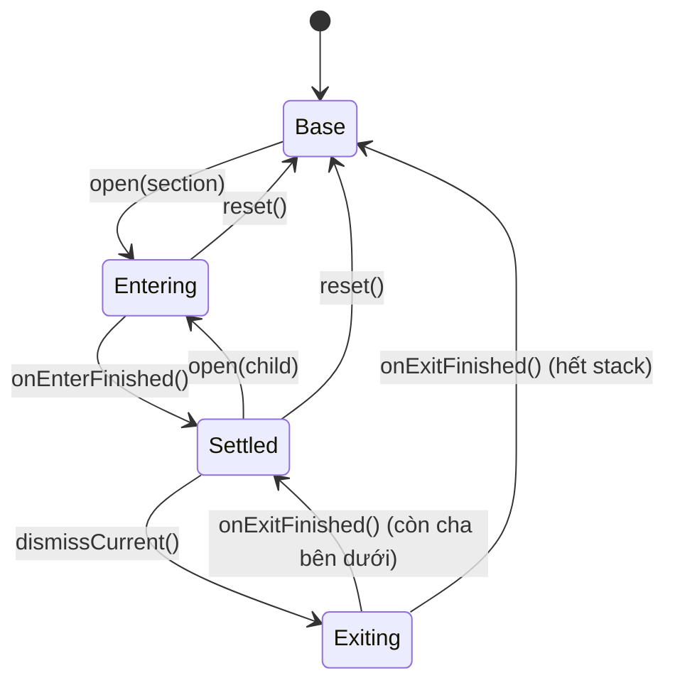

# Kiến trúc sections của player

Hai màn player — ngang (`PlayerScreen`) và dọc (`VerticalPlayerScreen`) — dùng **chung một** state
machine cho các panel xếp chồng lên video. Tài liệu này giải thích state machine đó, vì sao nó tốt
hơn cách làm hiển nhiên, và phần nào của hai màn là khác nhau.

> Cầu nối tới player native nằm ở [`native_player_bridge.md`](native_player_bridge.md).
> Quy tắc focus D-pad chung của app nằm ở [`flutter_tv_focus.md`](flutter_tv_focus.md).
> Hợp đồng sản phẩm: `../../steam_tv/spec/player.md` và `../../steam_tv/spec/vertical-player.md`.

Mẫu gốc: `ottclouds-android/feature/vertical-video-detail/tv/.../VerticalPlayerFocusState.kt`.

## 1. Vấn đề

Cách làm hiển nhiên cho panel là **một biến nullable** "section đang mở". Nó hỏng ở ba chỗ, và cả ba
đều chỉ lộ ra khi đã code xong:

| Cách hiển nhiên | Hỏng ở đâu |
|---|---|
| `PlayerSection? openSection` | Không diễn tả được Settings → Quality. Quay lại từ Quality phải dựng lại Settings từ đầu → mất vị trí scroll và mất đúng dòng người xem đang đứng |
| `bool isSettingsOpen` + `bool isEntering` + … | Các cờ trôi khỏi nhau. Panel đang trượt vào mà đã được coi là "mở" thì hai subtree cùng tin focus là của mình |
| Bỏ animation đi cho gọn | Panel biến mất đột ngột; focus rơi về video surface, và surface nuốt luôn phím tiếp theo |

Cả ba đều biểu hiện trên TV thành **remote đột nhiên không phản hồi** — lỗi khó tái hiện nhất trong
nhóm.

## 2. Giải pháp: `PlayerSectionStack`

Một **giá trị bất biến** với các phép chuyển thuần túy
([`player_section_stack.dart`](../lib/features/player/presentation/model/player_section_stack.dart)):

```dart
final class PlayerSectionStack {
  final List<PlayerSection> stack;      // panel đang mở, cha trước
  final PlayerSection? exitingSection;  // panel đang trượt ra
  final bool isEntering;                // panel trên cùng đang trượt vào
}
```

Ba trường, và mọi thứ khác đều suy ra được:

| Suy ra | Nghĩa là |
|---|---|
| `panelSection` | Panel đang nằm trên cùng: cái đang thoát, nếu không thì đỉnh stack |
| `sectionLayers` | Mọi panel **phải giữ trong cây** — kể cả cái đang trượt ra |
| `isPanelEntering` / `isPanelExiting` / `isPanelSettled` | Panel đang ở pha nào |
| `isBaseLevel` / `hasSectionInPlay` | Còn panel nào không — cái mà Back phải đọc |

Phép chuyển: `open` · `onEnterFinished` · `dismissCurrent` · `onExitFinished` · `reset`.

`open` và `dismissCurrent` **tự bỏ qua** khi đang có transition chạy dở, nên hai lần bấm nhanh không
thể lồng hai transition vào nhau và để stack mô tả một màn hình không có thật.

### Vì sao pha transition nằm trong stack

Đây mới là lý do type này tồn tại thay vì một `List` thường. Hai sự thật:

- Panel **đang trượt vào** thì chưa được giữ focus.
- Panel **đang trượt ra** thì vẫn phải nằm trong cây tới khi animation xong.

Mọi quyết định hiển thị và focus trên màn hình đều phụ thuộc vào hai điều đó. Tách chúng thành các
boolean cạnh cái list thì chúng sẽ trôi khỏi nhau.

### Vòng đời



Ai đóng vòng lặp? **Widget animation**, qua `onEnterFinished` / `onExitFinished`. Stack không tự
biết animation dài bao lâu. Thiếu một trong hai callback là màn hình kẹt với focus đậu ở anchor.

## 3. Focus: một owner duy nhất

[`resolvePlayerFocusOwner`](../lib/features/player/presentation/model/player_focus_owner.dart) là
hàm **thuần**, dùng chung cho cả hai màn:

```
error > parked > section > controller > surface
```

Một điểm bất đối xứng đáng đọc kỹ:

- Panel thoát về **base level** → focus trả thẳng cho chrome/surface. Đã có đích settled sẵn trên màn
  hình để nhận.
- Panel thoát về **panel cha** → phải **park**. Cha chưa nhận được focus cho tới khi animation nhả ra.

### `parked` là gì và vì sao bắt buộc

Mở panel làm control đang focus biến mất **ngay trong frame đó**. Flutter phản ứng bằng cách tìm thứ
focusable gần nhất — trên màn player đó là video surface — và surface nuốt luôn phím tiếp theo.

[`PlayerParkedFocusTarget`](../lib/features/player/presentation/widget/player_parked_focus_target.dart)
là một ô 1px **luôn nằm trong cây**, nuốt mọi phím. Park focus vào đó trước khi panel xuất hiện thì
cuộc tìm kiếm kia không bao giờ xảy ra.

**Và phải có người gỡ park.** `_Layer` (trong
[`player_section_host.dart`](../lib/features/player/presentation/widget/player_section_host.dart)) giữ
`FocusScopeNode` riêng và giành focus đúng lúc layer chuyển sang settled. Không làm được bằng
`autofocus`: `autofocus` chạy khi node attach lần đầu, mà panel attach lúc còn **đang trượt vào** —
lúc chưa được phép giữ focus.

> Hệ quả thực tế đã gặp: panel metadata ban đầu chỉ có text, không có gì focusable. Focus đậu vĩnh
> viễn ở anchor, anchor nuốt mọi phím, người xem **kẹt trong panel không thoát ra được**. Vì vậy
> mọi panel phải có ít nhất một thứ focusable — với metadata thì chính vùng scroll là focus target,
> và đó cũng là cách duy nhất đọc mô tả dài bằng remote.

#### Anchor phải `skipTraversal: true`

"Luôn nằm trong cây" cộng "luôn focusable" là một node dư đối với D-pad. Anchor nằm ở mép trái màn
hình, nên **`LEFT` từ control ngoài cùng bên trái (pill `Description`) đi thẳng vào nó** bằng
directional traversal — trong khi không có transition nào đang chạy.

Lúc đó model và thực tế lệch nhau: `resolvePlayerFocusOwner` suy ra owner từ section stack, mà stack
đang rỗng, nên màn hình tin rằng `controller` đang giữ focus. Thực tế anchor giữ focus và nuốt mọi
phím. Chrome tự ẩn theo đúng lịch, phím sau hiện nó lại, và nó hiện lại **không nút nào sáng**: yêu
cầu focus của chrome đi bằng `autofocus`, mà `autofocus` không đòi được focus khi một node anh em
trong cùng scope đang giữ. Kết quả là một controller nhìn thấy được nhưng bấm gì cũng vô tác dụng,
chỉ còn Back thoát ra — đúng thứ `spec/player.md` cảnh báo.

[`FocusNode.skipTraversal`](https://api.flutter.dev/flutter/widgets/FocusNode/skipTraversal.html) là
đúng công cụ: nó loại node khỏi mọi `FocusTraversalPolicy` nhưng `requestFocus()` vẫn chạy. Focus chỉ
tới anchor khi **màn hình chủ động park**, không bao giờ do người xem bấm phím.

## 4. Hai quy tắc render

Trong `PlayerSectionHost`:

1. **Mọi layer đều ở lại trong cây.** Settings không rời cây khi Quality mở đè lên, nên quay lại
   Settings khôi phục đúng vị trí scroll và đúng dòng đang đứng — miễn phí, vì chưa có gì bị dựng
   lại. Chỉ layer trên cùng được vẽ (`Opacity`).
2. **Chỉ layer trên cùng *đã settled* mới focusable.** `ExcludeFocus` bọc mọi layer khác — kể cả
   layer đang transition. Đó là thứ chặn phím D-pad chạm tới panel người xem không nhìn thấy.

## 5. Khác nhau giữa hai màn

| | Ngang (`PlayerScreen`) | Dọc (`VerticalPlayerScreen`) |
|---|---|---|
| Base level | Surface bị động; chrome hiện theo yêu cầu rồi tự ẩn sau 5s | Stage + interaction panel, cả hai luôn hiện và cùng focusable |
| Dùng `PlayerFocusOwner.controller` | Có | **Không bao giờ** — không có chrome tạm thời |
| Auto-hide timer | Có | Không |
| Đóng panel thì focus về đâu | Control đã mở panel đó | **Stage** — panel chưa từng biến mất, stage mới là chỗ người xem mong quay lại |
| Dismiss panel bằng Left | Không (Left trong panel là thao tác list) | **Có**, cạnh Back |
| Lối vào metadata | Pill `Description` ở cạnh trái control row | Chính title block |
| Video fit | `fit` — letterbox toàn màn | `zoom` — crop vào stage 9:16 |

Phần **giống nhau** là toàn bộ: `PlayerSectionStack`, `resolvePlayerFocusOwner`, `PlayerSectionHost`,
và mọi panel. Settings → Quality hành xử y hệt trên hai màn vì đúng nghĩa đen là **cùng một đoạn
code** — đó là lý do stack nằm ở tầng model chứ không nằm trong màn nào.

## 6. Cây section hiện tại

```
metadata          (Description pill / title block)
settings          (nút Settings)
├── quality
├── audio
└── subtitles
```

`PlayerSection.parent` khai báo quan hệ này. Đặt ở section chứ không truyền vào lúc `open` — vị trí
của một section trong cây là thuộc tính của chính nó, không phải của call site tình cờ mở nó.

Chọn một option sẽ **đóng panel option và lộ ra danh sách settings bên dưới**, để người xem thấy
đúng dòng vừa đổi thay vì bị trả thẳng về video.

## 7. Chưa port

| Của bản OttClouds | Vì sao |
|---|---|
| `EpisodeListSection` | Cần playlist API |
| `CommentSection` / `ReplySection` / `ReplyDetailSection` | Cần comment API |
| `UserPlaylistSection` | Cần user-playlist API |
| Vertical **pager** (vuốt lên/xuống sang video khác) | `HomeItem` chưa có khái niệm feed; player dọc hiện phát đúng một item |
| `PausePlayEffectIcon` (animation nhấp nháy) | Đã thay bằng glyph **tĩnh** đúng theo spec: với surface không có control row, một short đang pause phải phân biệt được với một short đang đứng hình |

Khi có API, mỗi mục là **một giá trị enum mới + một arm trong `switch`** của `PlayerSectionPanel` —
không phải sửa state machine.

## 8. Kiểm tra

State machine là giá trị thuần nên test được không cần widget tree:

```bash
flutter test test/features/player/presentation/model/player_section_stack_test.dart
flutter test test/features/player/presentation/model/player_focus_owner_test.dart
```

Hành vi D-pad thật thì test bằng widget test, lái bằng phím:

```bash
flutter test test/features/player/presentation/view/player_screen_test.dart
flutter test test/features/player/presentation/view/vertical_player_screen_test.dart
```
