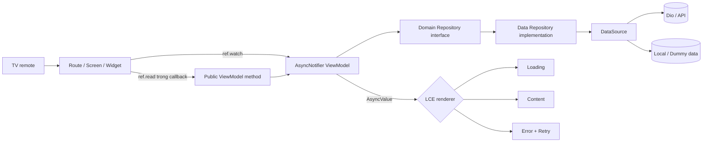
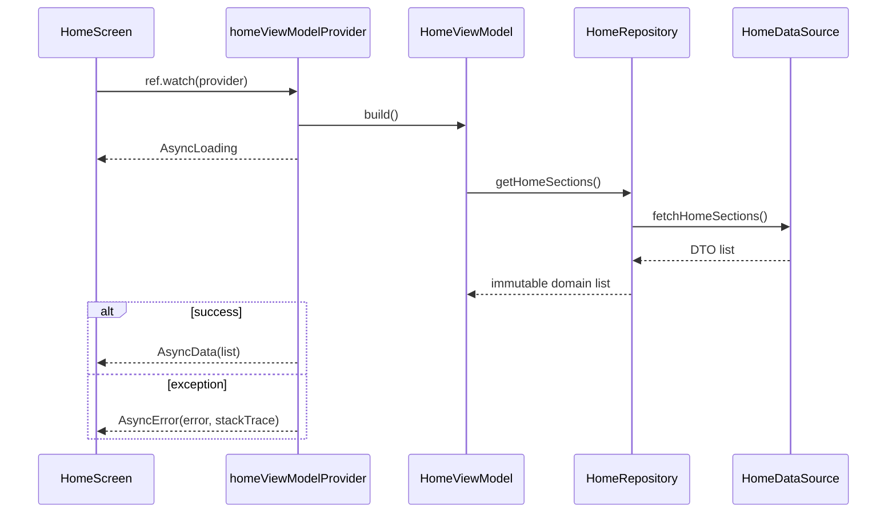

# Kiến trúc và quản lý state với Riverpod

Tài liệu này là quy ước nền cho `flutter_steam_tv`. Mục tiêu là port dần hành vi từ
`../android_stream_tv`, giữ cấu trúc feature-first và luồng phụ thuộc một chiều:
`View -> ViewModel -> Repository -> DataSource`.

> `doc_architechture` giữ nguyên tên thư mục theo yêu cầu ban đầu. Khi thêm tài liệu mới,
> tiếp tục dùng thư mục này để tránh tạo hai nơi lưu kiến trúc.

Riêng phần phát video có tài liệu riêng: [`native_player_bridge.md`](native_player_bridge.md) mô tả
cầu nối tới player native (Media3 trên Android TV, Tizen media player trên Samsung TV) và feature
`player` được dựng trên nó.

## Hình dung tổng thể



Riverpod gọi provider là một hàm có cache và tự quản lý invalidation, disposal, lỗi và override.
Xem định nghĩa chính thức tại [Providers](https://riverpod.dev/docs/concepts2/providers).

## Cấu trúc feature-first

```text
lib/
|-- app/
|   |-- router/
|   `-- stream_tv_app.dart
|-- core/
|   |-- assets/
|   |-- design_system/
|   |-- network/
|   `-- widgets/
`-- features/
    `-- home/
        |-- home_providers.dart
        |-- data/
        |   |-- mapper/
        |   |-- model/
        |   |-- repository/
        |   `-- source/
        |-- domain/
        |   |-- model/
        |   `-- repository/
        `-- presentation/
            |-- view/
            |-- view_model/
            `-- widget/
```

- `presentation`: render state, nhận thao tác remote và gọi method của ViewModel. Không gọi Dio hay
  DataSource.
- `ViewModel`: một class `@riverpod` kế thừa class generated. Nó expose state bất biến và các action
  công khai như `reload()`.
- `domain/repository`: interface mà ViewModel biết tới. Domain không import Flutter, Dio hay DTO.
- `data/repository`: triển khai interface, phối hợp DataSource và map DTO sang domain model.
- `data/source`: nơi duy nhất đọc API, database, file hoặc dummy data.
- `core`: chỉ chứa thành phần thật sự dùng chung cho nhiều feature. Không chuyển code vào `core` chỉ
  vì chưa biết nên đặt ở đâu.
- `home_providers.dart`: composition root của feature, là nơi duy nhất nối implementation data với
  interface domain. DataSource và Repository implementation không tự import Riverpod.

Không thêm UseCase ở giai đoạn này. Chỉ thêm khi cùng một nghiệp vụ cần phối hợp nhiều repository
hoặc được dùng lại bởi nhiều ViewModel.

## Các đối tượng Riverpod cần hiểu

| Đối tượng | Vai trò trong app | Quy ước |
|---|---|---|
| [`ProviderScope`](https://riverpod.dev/docs/concepts2/containers) | Tạo container state cho widget tree | Chỉ đặt một scope gốc trong `main.dart`; scope lồng chỉ dùng cho override có chủ đích |
| [`Provider`](https://riverpod.dev/docs/concepts2/providers) | Khai báo dependency/state có cache | Dùng code generation; provider là top-level |
| [`Ref`](https://riverpod.dev/docs/concepts2/refs) | Kết nối provider với provider | `watch` dependency trong `build`; `read` cho action nhất thời; `listen` cho side effect |
| [`ConsumerWidget`](https://riverpod.dev/docs/concepts2/consumers) | Nối widget tree với provider tree | Chỉ Route/Widget nhỏ cần state mới là Consumer |
| [`Notifier`/`AsyncNotifier`](https://riverpod.dev/docs/concepts2/providers#creating-a-provider) | State holder có public method | Đây là ViewModel của feature |
| [`AsyncValue`](https://pub.dev/documentation/riverpod/latest/riverpod/AsyncValue-class.html) | Union loading/data/error | Là LCE state chuẩn; không tạo thêm `isLoading + data + error` |

Code generation giúp cú pháp provider thống nhất cho sync, `Future` và `Stream`. Provider generated
mặc định auto-dispose; chỉ dùng `@Riverpod(keepAlive: true)` cho dependency sống cùng app như Dio,
router, DataSource hoặc Repository. Xem [About code generation](https://riverpod.dev/docs/concepts/about_code_generation)
và [Automatic disposal](https://riverpod.dev/docs/concepts2/auto_dispose).

## State thay đổi như thế nào

Luồng khởi tạo Home:



Luồng retry do người dùng kích hoạt:

```dart
Future<void> reload() async {
  state = const .loading();
  state = await AsyncValue.guard(
    ref.read(homeRepositoryProvider).getHomeSections,
  );
}
```

1. Widget dùng `ref.watch(homeViewModelProvider)` để tự rebuild khi state đổi.
2. Callback dùng `ref.read(homeViewModelProvider.notifier).reload()`. Không `watch` trong callback.
3. ViewModel gán `AsyncLoading`, nên View render Loading.
4. `AsyncValue.guard` đổi kết quả thành `AsyncData` hoặc exception thành `AsyncError` cùng stack trace.
5. View render Content hoặc Error; nút retry chỉ gọi lại action của ViewModel.

Không mutate list/object đang nằm trong state. Tạo object/list mới rồi gán state mới để Riverpod và
widget nhận biết thay đổi. Nếu chỉ muốn buộc provider chạy lại từ đầu, dùng `ref.invalidate(...)`;
nếu cần lấy ngay giá trị mới, dùng `ref.refresh(...)`. Với refresh UI, tham khảo ví dụ chính thức
[Implementing pull-to-refresh](https://riverpod.dev/docs/how_to/pull_to_refresh).

## LCE ở View

`Route` là nơi biết Riverpod. `Screen` nhận `AsyncValue` và callback, sau đó phân nhánh LCE. Các
widget Content/Loading/Error là widget thuần, nhờ vậy preview và test không cần container hay network.

```dart
final content = switch (state) {
  AsyncData(:final value) => HomeContentView(sections: value),
  AsyncError(:final error) => HomeErrorView(error: error),
  _ => const HomeLoadingView(),
};
```

Không chạy navigation, dialog, snackbar hoặc ghi log trong `build`. Khi cần phản ứng một lần theo
state, dùng `ref.listen` tại Route; tài liệu [`Ref`](https://riverpod.dev/docs/concepts2/refs) mô tả
khác biệt giữa `watch`, `read` và `listen`.

## Widget Preview

Mỗi screen hoặc widget UI mới/thay đổi đáng kể phải có preview xác định, không gọi network và không
phụ thuộc plugin native. Home có ba preview cho đủ LCE trong
`lib/features/home/presentation/view/home_screen_preview.dart`.

```bash
flutter widget-preview start
```

Widget Preview dùng `@Preview` từ `package:flutter/widget_previews.dart`; xem
[Flutter Widget Previewer](https://docs.flutter.dev/tools/widget-previewer). Kích thước TV mặc định
cho preview screen là 1280x720. Có thêm preview 1920x1080 khi layout thay đổi theo breakpoint.

## Dot shorthand

Dùng dot shorthand khi context type rõ ràng, ví dụ `brightness: .dark`, `kind: .video` hoặc
`const .loading()`. Không ép dùng nếu nó làm người đọc phải đoán type. Tính năng này yêu cầu Dart
3.10 trở lên; xem [Dot shorthands](https://dart.dev/language/dot-shorthands).

## Override và test

Thay dependency ở biên provider thay vì thêm cờ `isTest` vào production code:

```dart
final container = ProviderContainer.test(
  overrides: [
    homeRepositoryProvider.overrideWithValue(fakeRepository),
  ],
);
```

Widget test bọc bằng `ProviderScope(overrides: [...])`. Preview ưu tiên truyền state trực tiếp cho
Screen thuần. Xem [Testing your providers](https://riverpod.dev/docs/how_to/testing) và
[Provider overrides](https://riverpod.dev/docs/concepts2/overrides).

## Code generation và lint

Sau khi sửa class có `@riverpod`, `@freezed` hoặc `fromJson`:

```bash
dart run build_runner build
dart format .
flutter analyze
flutter test
```

Không sửa tay file `*.g.dart` hoặc `*.freezed.dart`.

Từ Riverpod 3.1, `riverpod_lint` dùng `analysis_server_plugin` và được cấu hình trực tiếp trong
`analysis_options.yaml`. Tại thời điểm setup, `custom_lint 0.8.1` khóa analyzer 8 còn
`riverpod_generator 4.0.9` cần analyzer 13+, vì vậy không ép hai package này vào cùng pub graph.
Ép `dependency_overrides` ở đây có thể làm analyzer hoặc code generation sai mà pub không bảo vệ được.

## Nguồn tham chiếu giao diện


Ảnh chỉ là tham chiếu hành vi/visual. Khi port một screen, đọc spec tương ứng trong
`../android_stream_tv/spec/` trước, rồi triển khai lại bằng Flutter thay vì dịch từng Composable.
